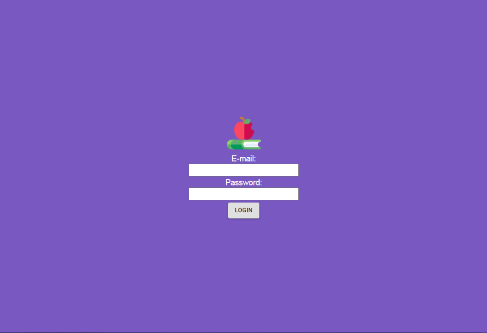
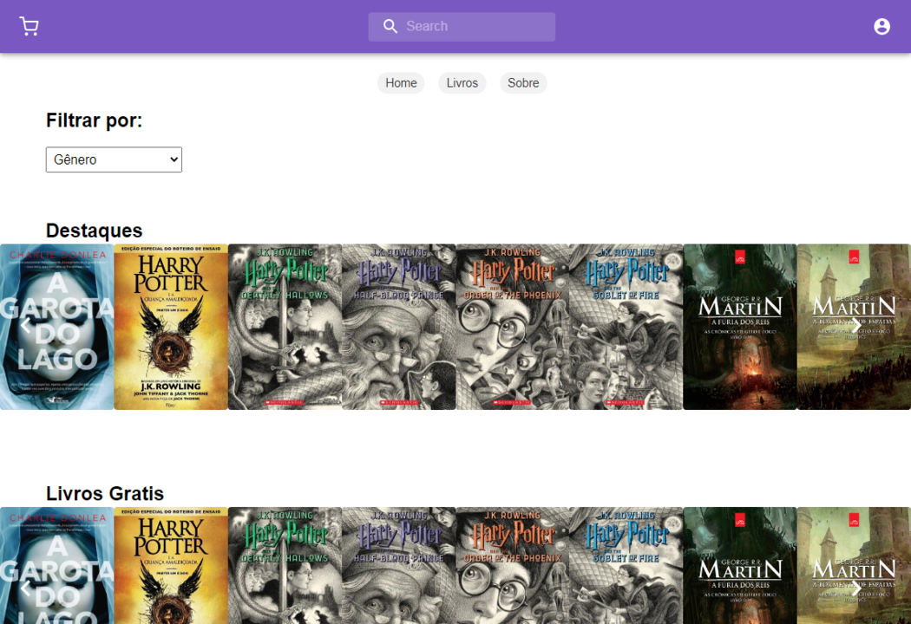

<h1 align="center">
    
</h1>

 
  O DigitalLibrary foi uma aplicação desenvolvida com fins 
  educativos, durante o meu 3°Modulo na etec de Embu, sendo 
  uma plataforma que auxilia na compra de livros, entretanto 
  apenas o front-end foi projetado.

## Aplicação 

### Login 

    

### Home 

    

### Livros 

    

### Sobre 

    

## Para rodar a aplicação

  * A primeira coisa é executar o comando yarn ou npm install,
  para instalar todas as dependencias necessárias.

  * Após a execução do comando yarn ou npm install efetue yarn start
  ou npm start.

## Tecnologias

  * ReactJS (Web Front-End);

  * React-Native (Mobile Front-End);

  * React-Router-Dom (Configuração das rotas);

  * Material-Ui (Biblioteca de componentes).

